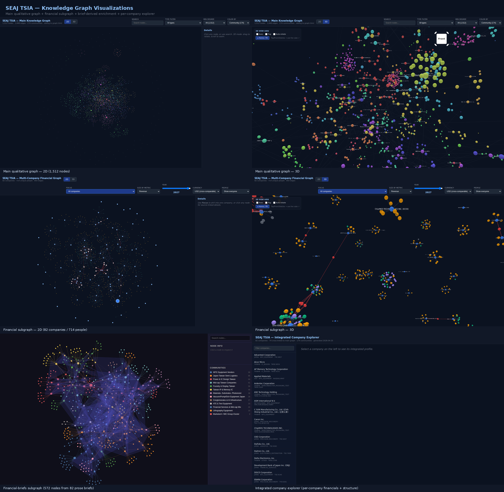

# seaj-tsia-study
{: .fs-9 }

Personal learning notes on the **Japan (SEAJ) + Taiwan (TSIA)** semiconductor supply chain — the Japanese equipment-and-materials ecosystem and the Taiwanese manufacturing ecosystem together form the spine of the global chip industry, and this repo is an attempt to map it from primary sources.
{: .fs-5 .fw-300 }



[Jump to the master table](#the-landscape-in-one-table){: .btn .btn-primary .fs-5 .mb-4 .mb-md-0 .mr-2 } [View on GitHub](https://github.com/kevinkicho/seaj-tsia-study){: .btn .fs-5 .mb-4 .mb-md-0 }

> **Scope:** annual reports, integrated reports, investor-day decks, product brochures, and standards documents covering ~90 companies and ~130 primary source files across the full value chain (materials → equipment → EDA/IP → fabless → foundry → OSAT → distribution → standards).
>
> **What's in this repo:** two complementary layers.
>
> 1. **Qualitative analysis** — five markdown documents distilled from the source PDFs (the original purpose of this repo).
> 2. **Structured financial extraction** — a Sonnet-vision pipeline that reads the same PDFs and produces a queryable SQLite database (82 companies, ~9,300 metric rows, multi-year balance sheets, 714-person network with cross-board detection), an interactive 2D/3D HTML graph viz, and a 62-test pytest suite. See [`graphify-financial/RUN_REPORT.md`](./graphify-financial/RUN_REPORT.md) for the full audit trail of how the data was built.
>
> Source PDFs are *not* redistributed here (copyright + size).

---

## Repository contents

| File | Purpose |
|---|---|
| [`00_VALUE_CHAIN_MAP.md`](./00_VALUE_CHAIN_MAP.md) | Navigable index of every tracked company, positioned by value-chain layer, with file references |
| [`01_DEEP_DIVE_ADVANCED_PACKAGING.md`](./01_DEEP_DIVE_ADVANCED_PACKAGING.md) | Long-form analysis of why packaging has become the industry's center of gravity, tying together OSATs, ABF substrate, HBM, CoWoS, hybrid bonding, and glass interposers |
| [`02_KEY_FINANCIALS.md`](./02_KEY_FINANCIALS.md) | Comparative KPI table and per-company narrative for ~20 issuers, drawn directly from the reports |
| [`03_READING_LIST_GAPS.md`](./03_READING_LIST_GAPS.md) | Prioritized list of companies the collection is missing (ASML, SK Hynix, NVIDIA, Tokyo Electron, Synopsys, Samsung, Micron, SMIC, etc.) and why each closes a specific analytical question |
| [`04_MASTER_BALANCE_SHEETS.md`](./04_MASTER_BALANCE_SHEETS.md) | Single balance-sheet mastersheet — Total Assets, Cash, Inventories, PP&E, Total Liabilities, LT Debt, Equity — for every company where data could be extracted (~15 rows) with USD normalization and cross-company analysis |
| [`05_MASTER_TIME_SERIES.md`](./05_MASTER_TIME_SERIES.md) | **Multi-year time-series** — Advantest 11y, Shin-Etsu 10y, Ebara 10y, CKD 12y, Kokusai 5y, ASE 5y, Disco 5y, Himax 3y, plus 2y for TSMC / UMC / MediaTek / Lam / AMAT / ASM / Teradyne / KLA. Interactive multi-company line chart with metric / currency / indexed-growth controls |
| [`KNOWN_LIMITATIONS.md`](./KNOWN_LIMITATIONS.md) | Self-aware caveats — temporal decay, geographic bias, PDF-extraction losses, source bias |
| [`.gitignore`](./.gitignore) | Excludes all PDFs/images/binaries so the repo stays small and copyright-clean |
| [`_config.yml`](./_config.yml) | Jekyll configuration for GitHub Pages |

**Suggested reading order:** `00` → `03` (shape of industry + gaps) → `01` (the biggest thematic deep dive) → `02` (income-statement numbers) → `04` (balance-sheet numbers) → `05` (multi-year trends) → `KNOWN_LIMITATIONS` (humility).

### Structured-extraction layer (added 2026-04)

| File / dir | Purpose |
|---|---|
| [`graphify-financial/financials.db`](./graphify-financial/financials.db) | **SQLite store** — 82 companies, 9,298 metric rows (1,453 canonical), 520 financial pages, 714 people, 950 affiliations, FX rates, validation issues. Indexed for `(company_id, year, canonical_name)` lookups. ~3 MB. |
| [`graphify-financial/graph-financial.json`](./graphify-financial/graph-financial.json) | Multi-company financial subgraph (companies + people + affiliations) in graphify-compatible schema. |
| [`graphify-financial/graph-financial.html`](./graphify-financial/graph-financial.html) | Self-contained interactive viz — vis-network 2D + 3d-force-graph 3D toggle, year slider, metric-driven node sizing, click-to-source sidebar. ~1.7 MB; opens in any modern browser. |
| [`graphify-financial/graph-integrated.html`](./graphify-financial/graph-integrated.html) | **Integrated company explorer** — joins financials + main-graph structure. Per-company view: financial table (all canonical metrics, all years, local + USD), main-graph community + supplier/customer/product relationships, and people (with cross-board flags). Filter by name/country/industry. ~400 KB. |
| [`graphify-financial/RUN_REPORT.md`](./graphify-financial/RUN_REPORT.md) | Full audit trail of the scaling run that built the database. |
| [`graphify-financial/AUDIT_REPORT.md`](./graphify-financial/AUDIT_REPORT.md) | Per-company quality findings (blockers, warnings, info) from `audit_extractions.py`. |
| [`graphify-financial/<key>/<key>_extraction.json`](./graphify-financial) | Per-company raw extraction (financial pages + people pages) — the source of truth that the SQLite is built from. |
| [`graphify-financial/corrections.json`](./graphify-financial/corrections.json) | HITL overrides for the 11 subtotal-validation failures, with PNG-evidence citations. Applied via `scripts/apply_corrections.py`. |
| [`scripts/`](./scripts) | Pipeline: triage → page detection → rasterize → vision-extract → cross-validate → ingest → graph build → viz. See [Structured financial extraction](#structured-financial-extraction) below. |
| [`tests/`](./tests) | 62 pytest tests covering schema integrity, data validity, accuracy (subtotal recompute, cross-page consistency), coverage, performance (query latency, DB size), graph integrity, and durability (idempotency, scale stress, concurrent reads, snapshot regression). |

---

## The landscape in one table

Every company in the collection, with role/moat, latest-reported financials where extracted, and a one-line strategic signal. Currency units in the figures column are noted per row (US$ / NT$ / ¥ / €). "FY24" for Taiwan = calendar 2024; Japanese FYs end Mar 31 or Jun 30; US fiscal years vary — the exact end-date is shown where relevant.

| # | Company (HQ, ticker) | Layer | Role / moat | Latest fiscal (FY, Rev, YoY, GM, OpM) | Strategic signal | Source file |
|---|---|---|---|---|---|---|
| 1 | **Shin-Etsu Chemical** (JP, 4063) | Materials | Global #1 silicon wafer supplier (~30% share); also top-3 photoresist | n/e | Silicon-wafer duopoly with SUMCO; chemicals conglomerate model diversifies cyclicality — rare combination of breadth + share leadership | `Annual-Report-2025 SHINETSU.pdf` |
| 2 | **JSR** (JP, 4185) | Materials | Top-3 global KrF/ArF/EUV photoresist | n/e | Being taken private by JIC; EUV-resist share + partnership with IBM is the leading-edge exposure | `JSR_annual report_2024_2025_e_all.pdf` |
| 3 | **Ajinomoto Fine-Techno** (JP, 2802 subsidiary) | Materials | **Monopoly on ABF** (Ajinomoto Build-up Film) — the dielectric in virtually every CPU/GPU flip-chip substrate | n/e | If Intel/AMD/NVIDIA ship it, ABF is in it. Monopoly threatened only by glass-substrate transition post-2027 — the single most under-appreciated semi monopoly | `AJINOMOTO FINE INC ABF-presentation.pdf` |
| 4 | **Senju Metal Industry** (JP) | Materials | Solder paste + fine-pitch bonding materials for advanced packaging | n/e | Every flip-chip bump and TSV micro-bump uses solder — Japan's niche makers own the <40 µm pitch segment | `SENJU 2025_soldering_materials_catalogue.pdf`, `bonding material performance SENJU chart01.png` |
| 5 | **Lintec** (JP, 7966) | Materials | Back-grinding + dicing tape consumables | n/e | Sticky consumable business (literally); HBM demand drives thin-wafer grinding tape volume | `Integrated_Report_2025_all LINTEC.pdf` |
| 6 | **UACJ** (JP, 5741) | Materials | Aluminum for interposers, heat spreaders, packaging shells | n/e | Commodity-adjacent but thermal-alloy formulation has real IP; TSMC advanced-package ramp is a demand pull | `00 UACJ integrated report 2025.pdf` |
| 7 | **Leatec Fine Ceramics** (TW) | Materials | Ceramic chucks, heaters, end-effectors for semi equipment | n/e | A TW-local supplier to AMAT/Lam/TEL tools in Taiwan fabs — rare TW play in equipment-grade ceramics | `LEATEC FINE CERAMICS 2024Annual Report.pdf` |
| 8 | **Nikon** (JP, 7731) | Litho | Distant #2 to ASML in ArFi steppers; lost EUV race | **Q1-Q3 FY25 (Apr-Dec 24): ¥483.9 B (-5.6% YoY); OpM -21.4% (¥90.6B impairment in Digital)** | Survival story, not winning story; ¥700B mid-term rev target looks stretched given litho-segment losses | `26third_all_e NIKON 3Q 2025 Result.pdf` |
| 9 | **Canon** (JP, 7751) | Litho | ArFi steppers + **sole commercial vendor of nano-imprint lithography (NIL)** — the only credible EUV alternative | n/e | NIL is a decade-long bet. Customer adoption (Kioxia, Canon itself) still tiny; optionality, not a thesis | `phase7-e CANON presentation JAN 2026.pdf`, `conf2025e CANON fy2025 result.pdf`, `Canon-Broadcast-CINEMA-Lens-Lineup.pdf` |
| 10 | **NuFlare Technology** (JP) | Litho | Near-monopoly maker of **e-beam mask writers** for EUV masks | n/e | Every EUV mask in the world starts on an IMS or NuFlare writer; this is the "factory of the factories" | `img_business01 NUFLARE japan.png` |
| 11 | **Elionix** (JP) | Litho | R&D / niche e-beam lithography | n/e | Tiny. Academic + specialty fab customer. Not a commercial thesis | `ELIONIX JAPAN ELS-BODEN litography img6310549954213*.png` |
| 12 | **Lasertec** (JP, 6920) | Metrology | **Sole supplier** of actinic EUV mask & blank inspection — process monopoly | **FY25 (Jul24-Jun25): ¥251.4 B (+17.8%); OpM 48.8% record; NI ¥84.6B (+43.3%)** | Monopoly economics. BUT orders -60% YoY (¥272.7B→¥105.2B) and FY26 guided -20% revenue — first decline in 12 years. Cycle inside a cycle | `Integrated report LASERTEC 2025.pdf` |
| 13 | **KLA** (US, KLAC) | Metrology | Global wafer inspection / overlay / CD metrology leader (~50% share) | **FY25 (Jun end): US$12.2 B (+24%); Process Control 90% of revenue (+25%)** | Semi Process Control segment durable monopoly; RPO backlog -20% YoY is a warning; 89% international revenue | `KLAC 2025 Annual Report (bookmarked).pdf` |
| 14 | **Hitachi High-Tech** (JP) | Metrology | Near-monopoly in **CD-SEM** in-line metrology; also etch, analytical | n/e | Unsung essential tool — every advanced logic fab runs Hitachi CD-SEMs inline. Buried inside Hitachi conglomerate | `naka_e HITACHI HIGH-TECH future.pdf`, `profile-en-pdf HITACH HIGH-TECH.pdf` |
| 15 | **JEOL** (JP, 6951) | Metrology | TEM/SEM, mass spec, NMR, e-beam systems | n/e | High-end electron microscopy monopoly (alongside Thermo Fisher). AI-driven mat-sci demand is the tailwind | `integrated_report_2025_a3_en JEOL.pdf` |
| 16 | **Shimadzu** (JP, 7701) | Metrology | Analytical instruments — mass spec, chromatography | n/e | Broader than semi; semi-segment is a fraction but high-margin | `shimadzu_integrated_report_2025 SHIMADZU.pdf` |
| 17 | **Horiba** (JP, 6856) | Metrology | Gas/flow/particle measurement for fabs | n/e | Niche but embedded — every gas line in every fab has a Horiba MFC | `csm_24.04_woven_9c6c4311dd HORIBA corporation.webp` |
| 18 | **Zeiss** (DE, private) | Metrology | **EUV optics supplier to ASML**; 3D metrology systems | n/e | Optics monopoly for EUV — without Zeiss there is no ASML scanner. Private → no public financials but brand-level moat | `20250826_zeiss_aramis_brochure_digital_en.pdf`, `2025_ScanBox_BR_Digital_EN.pdf`, `241210_zeiss_tritop_brochure_en.pdf`, `zeiss_atos_5_brochure_en.pdf`, `Flyer_OMNIA_GC_220-180_A4_EN.pdf` |
| 19 | **Accretech / Tokyo Seimitsu** (JP, 7729) | Metrology | #2 in dicing (after Disco) + probers + metrology | **FY25 (Mar end): ¥150.5 B; guide ¥185 B** | HBM-driven prober demand is a positive; the dicing-vs-Disco share contest is durable | `IntegratedReport2025_E ACCRETECH 2025.pdf` |
| 20 | **Applied Materials** (US, AMAT) | Deposition/Etch | **Largest WFE company globally** by revenue; broadest portfolio (PVD/CVD/epi/CMP/implant) | **FY25 (Oct end): US$28.37 B (+4.4%); GM 48.7% (+1.2pp); OpM 29.2%; CapEx US$2.3 B** | Margin expansion despite ~flat revenue; **China mix dropping 19%→15%** as controls bite; advanced-packaging is new growth leg | `2025 Annual Report (Bookmarked) APPLIED MATERIALS.pdf`, `APPLIED_MATERIALS_JP_03162026_zgC1WO.png` |
| 21 | **Lam Research** (US, LRCX) | Deposition/Etch | #1 in etch; leader in plasma ALD/CVD | **FY25 (Jun end): US$18.4 B; diluted EPS $4.15 (record); op cash flow $6.2 B; CSBG svc revenue $4.46 B** | Most memory-exposed of the US WFE; HBM-driven DRAM etch/dep orders lifted FY25; less whipsawed than Lasertec because diversified | `LAM+RESEARCH+CORP_BOOKMARKS_2025_V1 annual report 2025.pdf` |
| 22 | **ASM International** (NL, ASM) | Deposition | **ALD leader** (atomic layer deposition) — critical at sub-7nm + GAAFET | **FY25 (Dec end): €3.2 B; GM 51.8%; adj OpM 30.2% (record); FCF €615M (+12%)** | Structural beneficiary of GAAFET (N2 transition = more ALD steps); 2030 target €5.7B at 30%+ OpM | `asm-2025-annual-report.pdf`, `annual-report-2024-asm-final.pdf` |
| 23 | **ULVAC** (JP, 6728) | Deposition | PVD (sputtering) + vacuum technology | n/e | Mid-tier by revenue; broader than semi (flat-panel, solar). Watch semi-segment mix | `ULVAC_CorporateProfile_en_2025.pdf` |
| 24 | **Kokusai Electric** (JP, 6525) | Deposition | Global leader in **batch (vertical-furnace) thermal ALD** | **FY25 (Mar end): ¥238.9 B (+32%); GM 42.6%; OpM 21.5%; R&D ¥15.6B (6.5%)** | Top global share in batch ALD + plasma gate modification; ¥330B revenue target = ~38% upside; equipment 75% / service 25% | `CorporateProfile2025_en KOKUSAI ELECTRIC 2025.pdf` |
| 25 | **Shibaura Mechatronics** (JP, 6590) | Deposition | Wafer processing, PVD, dicing | n/e | Niche integrated equipment maker; Shinagawa HQ renewal hints at strategic reset | `00 SHIBUARA integrated report 2025.pdf`, `2024 Shinagawa Update_20240530.pdf` |
| 26 | **Ebara** (JP, 6361) | CMP/Vacuum | **#1 in semi dry-vacuum pumps**; CMP tools (AMAT's only real competition) | **~¥0.8 T rev (2022); E-Plan 2025 target ¥1T rev, 15%+ ROIC; 70% overseas** | Every fab needs vacuum pumps → consumable-like recurring revenue; CMP share grind against AMAT is multi-decade | `INT25_all_EN_1 EBARA corporation 2024.pdf` |
| 27 | **SCREEN Holdings** (JP, 7735) | Cleans | **#1 share in single-wafer cleaners**; major coater/developer | n/e | Paired with TEL coaters in every advanced fab; clean-yield criticality = pricing power | `SPE_GeneralCatalog_Digital_251209 Screen japan.pdf` |
| 28 | **CKD** (JP, 6407) | Components | Pneumatics, gas valves, integrated gas panels | n/e | Japan industrial-automation workhorse; semi-segment exposure rising with fab-buildout cycle | `CKD ckdreport2025en_all_web.pdf` |
| 29 | **AI Mechatec** (JP) | Components | Optical bonding and vacuum-lamination equipment | n/e | Panel-level / advanced-packaging tool supplier; niche with limited English disclosure | 15 `AI_MECHATEC_JP_*.jpg` images |
| 30 | **HTC Japan** (JP) | Components | Vacuum valves and components | n/e | Privately held; English disclosure limited to product brochures | `HTC vacuum en-company-profile.pdf`, `htcvacuum-valves 2021 product guide.pdf` |
| 31 | **Ayumi Industries** (JP) | Components | Vacuum-system components | n/e | Tiny niche supplier; Japanese-only rigorous disclosure | `AYUMI_JP_vacuum_*.jpg` |
| 32 | **Meiritz Seiki** (JP) | Components | Precision vacuum / mechanical components | n/e | Micro-cap; not meaningfully analyzable from English materials alone | `MEIRITZ_JP_03182026_5bLz3l.jpg` |
| 33 | **Rikken Keiki** (JP, 7734) | Components | **Gas detection systems** (HF, SiH4, Cl2) — fab safety monopoly in Japan | n/e | Safety-regulated market with high switching cost; domestic-heavy | `Integrated_report_2025_A4_eng RIKKEN KEIKI 2025.pdf`, `Financial_Results_Briefing_Materials_for_the_Fiscal_Year_Ended_March_2025 RIKKEN KEIKI.pdf` |
| 34 | **SINFONIA Technology** (JP, 6507) | Components | Clean material handling, vibration control | n/e | Fab AMHS-adjacent; partner ecosystem around Daifuku | `EN_about-fig-11_2025 SINFONIA.jpg`, `about-fig-1 SINFONIA japan company.png` |
| 35 | **Organo** (JP, 6368) | Utilities | **Ultrapure-water (UPW) systems** for fabs | n/e | Every new fab needs UPW; Japan-local oligopoly with Kurita | `ORGANO Financial-Results-for-First-Half-of-Fiscal-Year-Ending-March-31-2026.pdf` |
| 36 | **Adatech** (JP) | Utilities | Water & wastewater treatment | n/e | Niche industrial water supplier; limited financial disclosure | 4 `ADATECH water industry 2026 Screenshot*.png` |
| 37 | **Marumae** (JP, 6264) | Components | Custom-machined Al/quartz/SiC parts for semi equipment OEMs | n/e | Long-cycle supplier to AMAT/Lam/TEL; tied to WFE capex | `MARUMAE_annual_report_2025en.pdf` |
| 38 | **Panasonic Industry** (JP, part of 6752) | Components | Capacitors, industrial devices | n/e | Commodity-adjacent; tiny piece of Panasonic group | `PANASONIC INDUSTRY ir-pre2024_pid_e.pdf` |
| 39 | **Misumi Group** (JP, 9962) | Components | Factory components e-commerce / MRO | n/e | Cross-industry; semi is a small slice of business mix | `MISUMI_Integrated_Report_2025_English_all_ver.2.pdf` |
| 40 | **Raydent** (JP) | Components | Plating / surface treatment chemicals | n/e | Niche; English materials are fragments | `RAYDENT_03222026_35Pu4V.gif` |
| 41 | **Disco** (JP, 6146) | Dicing | **Near-monopoly in wafer dicing saws + grinders** — HBM thinning, CoWoS | **⚠️ FY2020 report in folder (stale): ¥141.1 B; OpM 25.8%. Current (FY24) revenue is ~¥400 B driven by HBM** | Single most under-disclosed HBM beneficiary in this folder; **add a current Disco annual urgently** | `dar2020 DISCO ANNUAL report 2020.pdf` |
| 42 | **Micronics Japan** (JP, 6871) | Probe cards | **Advanced probe cards** — HBM, AI accelerators | n/e | HBM probe cards cost >$500K each; MJC is a quiet HBM beneficiary alongside Advantest | `LINEUP2026 MICRONICS JAPAN.pdf` |
| 43 | **Favite** (TW, 3131) | Probe cards | Probe pin and probe card supplier | n/e | TW-local second-source to MJC/FormFactor; smaller scale | `FAVITE annual report 2024 113年報_英文版上傳.pdf` |
| 44 | **S-Takaya** (JP) | Probe cards | Burn-in test boards, test sockets | n/e | Niche; Japanese-only disclosure | `sty_pamphlet_en S-TAKAYA corporation japan 2021.pdf` |
| 45 | **Interaction** (JP) | Back-end equip | Die bonders, back-end equipment | n/e | Mid-term plan (2024-2028) in folder is the primary artifact; small-cap | `INTERACTION_JP_Medium-Term-Business-Plan（2024-2028）.pdf` |
| 46 | **Advantest** (JP, 6857) | ATE | **HBM test monopoly** + SoC ATE (~55% global share) | **FY25 (Mar end): ¥779.7 B (+60.3%); NI ¥161.2 B; OpM 29.3%; ROIC 31.5%** | **Purest AI pick-and-shovel in the entire folder.** HBM is tested with Advantest; AI accelerators need 3-4× test time. MTP3 target ¥835-930B rev, 33-36% OpM | `E_all_IAR2025 ADVANTEST annual report 2025.pdf` |
| 47 | **Teradyne** (US, TER) | ATE | SoC ATE (iPhone/AMD/NVIDIA) + industrial robotics (UR + MiR) | **FY25 (Dec end): US$3.2 B; GM 58.3%; OpM 22.3%; Q4 >60% AI-driven**; **FY28 target ~US$6B rev, 59-61% GM, 30-34% OpM** | Target model implies doubling revenue — credible if ATE TAM grows to US$12-14B on AI-accelerator + HBM | `ALL_Analyst_Day_2025_IR_SITE_NEW TERADYNE investor day Mar 2025.pdf`, `Teradyne_EC Q4'25 Slides Feb2026.pdf` |
| 48 | **Daifuku** (JP, 6383) | Automation | **OHT AMHS monopoly** for 300mm fabs | n/e | Every new fab builds in Daifuku OHT rails; indispensable but margins compressed by OHT price wars | `DAIFUKU_FY2025Q4e_presentation.pdf` |
| 49 | **Seino Holdings** (JP, 9076) | Logistics | Third-party logistics for supply chain | n/e | Not semi-specific; template for supply-chain resilience reporting | `2024annual report SEINO.pdf` |
| 50 | **CSUN Manufacturing** (TW, 6274) | Niche equip | Solar + semi production equipment | n/e | Broader than semi; Taiwan process-equipment niche | `CSUN annual report 2024*.pdf` |
| 51 | **Creating Nanotech** (TW, 3055) | Niche equip | Nano-imprint and patterning equipment | n/e | Tiny; NIL exposure if Canon's bet plays out | `CREATING NANOTECH 2025CNT_pdfc_*.pdf` |
| 52 | **Gallant Precision Machining** (TW, 5443) | Niche equip | LCD + semi equipment | n/e | Mid-cap; dual display + semi exposure | `GALLANT annual report 2024*.pdf` |
| 53 | **Ardentec** (TW, 3264) | Test services | Independent test house | n/e | TW test-services layer below KYEC scale; commodity-adjacent | `ARDENTECH annual report 2024 年報ESG.pdf` |
| 54 | **Manz** (DE/TW) | Niche equip | **TGV (through-glass via) + IC substrate solution tools** | n/e | If glass substrates replace ABF (Intel piloting), Manz is the TGV tool play; pre-commercial optionality | `MANZ 2025_0923_TGV-solutions_DataSheet.pdf`, `MANZ 2025_EN_IC_substrate_flyer_1027.pdf`, `Manz_brochure_Contract-Manufacturing_EN-4.pdf`, `2025_0923_TGV-solutions_DataSheet.pdf`, `2025_EN_IC_substrate_flyer_1027.pdf` |
| 55 | **ITW / Lumex** (US, ITW) | Consumables | Tape-and-reel packaging | n/e | Commodity consumable; conglomerate slice | `Flyer-20221128-ITW-Lumex-EN-No-W_SD.pdf` |
| 56 | **Caddi** (JP) | Platform | Procurement / manufacturing e-commerce | n/e | Not semi-specific; digital-enablement play for JP SME machining ecosystem | `CADDI_SAMPLE_2026_03162026_xSqDNf.png` |
| 57 | **Cadence Design Systems** (US, CDNS) | EDA | EDA #2 + chiplet-based Physical AI platform | n/e | EDA is a 3-firm oligopoly; margins match software. Chiplet-design tooling is the emerging growth vector | `CADENCEchiplets-based-physical-ai-platform.jpg` |
| 58 | **ARM** (UK, ARM) | IP | Ubiquitous CPU IP (Cortex-R/M/A) | n/e | Datasheet in folder is a specific Cortex-R52 product reference, not company disclosure; ARM IP model is the industry's deepest toll | `ARM_Cortex-R52_datasheet.pdf` |
| 59 | **eMemory** (TW, 3529) | IP | **Embedded NVM IP monopoly** (OTP, MTP, anti-fuse) in foundry PDKs | n/e | Royalty model → recurring revenue per wafer shipped on licensed nodes; underappreciated TSMC-exposed IP | `eMemory annual report 2024 0250521170001.pdf` |
| 60 | **M31 Technology** (TW, 6643) | IP | Foundation IP (I/O, PLL, interface IP) | n/e | Smaller TW IP vendor; niche per-node licensing | `M31 annual report 2024 113M31股東會年報ENG-1.pdf` |
| 61 | **AP Memory** (TW, 6531) | IP/IDM | Specialty DRAM IP (PSRAM, low-power) | n/e | Hybrid IP-IDM model; LP-memory niche for IoT/wearable | `AP MEMORY annual report 2024年度年報英文版.pdf` |
| 62 | **MediaTek** (TW, 2454) | Fabless | **#2 global SoC** (mobile/TV/WiFi/auto); entering AI-ASIC | **FY24 (Dec): NT$530.6 B (+22.4%); GM 49.6% (+1.8pp); OpM 19.3% (+2.7pp); EPS NT$66.92 (+38%)** | **Flagship mobile rev doubled to >US$2B**; SerDes + CPO ASIC positioning pokes at Broadcom/Marvell territory | `MEDIATEK 2024-English-Annual-Report.pdf` |
| 63 | **Realtek** (TW, 2379) | Fabless | PC/NB connectivity (audio codec, WiFi, LAN) | n/e | Mature share leader in PC audio/LAN; WiFi-7 is the upgrade cycle | `2024_Annual_Report_REALTEK.pdf` |
| 64 | **Phison Electronics** (TW, 8299) | Fabless | **NAND flash controllers #1 or #2 globally** | **FY24 NI NT$7.953 B (individual); plan to grow R&D headcount to 3,500-3,600** | Pure NAND-cycle play; benefits from AI-server SSD demand expansion | `Phison_Electronic_Corporation_2024_Annual_Report.pdf` |
| 65 | **Himax** (TW, HIMX) | Fabless | Display drivers + WLO optics | **FY24 82.9% rev from display drivers (vs 85.1% FY23); Customer A = 26.4%** | Slow diversification out of driver-IC concentration; automotive TDDI + WLO the new growth legs | `Himax_2024_Annual_Report.pdf` |
| 66 | **Megawin Technology** (TW, 6215) | Fabless | 8-bit MCUs, touch controllers | n/e | Commodity MCU; China-exposed | `2026H1_Megawin_Brochure(EN)_v1.0.pdf`, `MEGAWIN taiwan annual report 2024 chinese 113.pdf` |
| 67 | **Richwave** (TW, 4968) | Fabless | RF ICs — WiFi FEMs, PA/LNA | n/e | Mid-tier fabless; WiFi-6E/7 upgrade beneficiary | `RICHWAVE annual report 2024 2025051316564662.pdf` |
| 68 | **Weltrend** (TW, 2436) | Fabless | USB-PD controllers, monitor SoC | n/e | USB-C / PD ramp beneficiary; niche | `Weltrend 2024 Sustainability Report.pdf` |
| 69 | **Alcor Micro** (TW, 3227) | Fabless | Card readers, USB/Thunderbolt hubs | n/e | Niche legacy-PC peripheral | `ALCOR fabless 2024_AnnualReport_EN.pdf`, `2024_AnnualReport_EN.pdf` |
| 70 | **EGIS Technology** (TW, 6462) | Fabless | Fingerprint sensors | n/e | Android-exposed; commoditized sub-segment | `EGIS annual report 2024 神盾113年報-EN-上傳版-1.pdf` |
| 71 | **Grace Haozan** (TW) | Fabless | Mixed-signal / LED | n/e | Micro-cap; limited English disclosure | `GRACE HAOZAN products list Screenshot 2026-03-15 090412.png` |
| 72 | **MIC** (TW) | Design svcs | Design services + IP | n/e | Small-cap TW design-house | `MIC taiwan annual report 2024 2505091655322f091.pdf` |
| 73 | **Nanya Technology** (TW, 2408) | Memory IDM | DRAM (DDR3/DDR4, niche LPDDR4) | n/e | Trailing DRAM; no HBM; mature-node survivor | `2025 Nanya Tech Product Brochure_V4.pdf` |
| 74 | **Winbond** (TW, 2344) | Memory IDM | Specialty memory (SpiFlash, SpiNAND, LPDDR) | Q4 '25 investor deck in folder | Specialty memory niche; avoids commodity DRAM war | `4Q25-investor-conference_EN_Final Windbond 2025.pdf`, `2024 WIN Annual Report.pdf` |
| 75 | **Episil Technologies** (TW, 3438) | Specialty IDM | Power-discrete on 150mm | n/e | Legacy node, specialty markets (power, industrial) | `EPISIL_News_20240701 annual report 2024.pdf` |
| 76 | **Fuji Electric** (JP, 6504) | Power IDM | IGBT + SiC power modules | n/e | Auto-SiC ramp is the narrative; competes with Infineon/STM | `FUJI_ELECTRIC_ar2025_02_02_e.pdf`, `FUJI_ELECTRIC_ar2025_02_04_e.pdf` |
| 77 | **AMS OSRAM** (AT/DE, AMS) | Sensors | Optical/biometric sensors (PPG, LiDAR) | n/e | Post-merger restructuring; Apple-sensor exposure key | `AMS OSRAM sensor biomonitoring SFH 7072_EN.pdf` |
| 78 | **TSMC** (TW, 2330 / TSM) | Foundry | **#1 global foundry ~60% share**; leading-edge + CoWoS advanced pkg | **FY24 (Dec): US$90.08 B (+30%) / NT$2,894.3 B (+33.9%); GM 56.1% (+1.7pp); OpM 45.7% (+3.1pp); NI US$36.52 B (+35.9%); R&D US$6.36 B; 12.9M wafers shipped** | "Foundry 2.0" redefinition = claims 34% share of broader market (vs 28% under old def); **≤7nm = 69% of wafer revenue**; CoWoS capacity-constrained through 2025 | `2024 Annual Report-E TSMC.pdf`, `2024 Annual Report.pdf` |
| 79 | **UMC** (TW, 2303) | Foundry | #2 TW foundry; mature nodes (28/22nm) | **FY24 (Dec): NT$232.3 B; GM 32.6%; OpM 22.2%; EPS NT$3.80; R&D NT$15.6B (6.7%)** | Mature-node foundry with structurally lower but stable margins; US partner-fab diversifies geo | `2024AR_ENG_all UMC United Microelectronics Corporation Annual report 2024.pdf` |
| 80 | **VIS / Vanguard** (TW, 5347) | Foundry | 8" specialty foundry; **NXP JV (VSMC) in Singapore**; 30% TSMC-owned | n/e (in financial-statement section) | VSMC JV ramping 2024-26 is the key catalyst; analog/power/BCD customer base | `20250506232053383995188_en VIS annual report 2025.pdf`, `Screenshot 2026-03-09 123342 vis annual report 2001.png`, `vis company 030926`, `Screenshot 2026-03-09 120332.png` |
| 81 | **PSMC / Powerchip** (TW, 6770) | Foundry | Memory + logic foundry; **JV with Tata for India fab** | **FY24 (Dec): NT$44.7 B** | India fab (Dholera) is the long-dated bet; mature-node positioning | `PSMC Annual_Reports_2024_EN.pdf` |
| 82 | **WIN Semiconductors** (TW, 3105) | Foundry | **#1 global GaAs compound-semi foundry** (RF PA) | n/e | Mobile-RF PA cycle; 5G FEM demand steady; niche monopoly | `2024 WIN Annual Report.pdf` |
| 83 | **Global Foundries** (US, GFS) | Foundry | US specialty foundry (RF, auto, FD-SOI) | **2025: US$6.79 B rev; 2.3M wafers; ~13,000 employees** | Deliberate non-leading-edge strategy; CHIPS Act beneficiary; auto/industrial exposure | `GLOBAL FOUNDRIES-At-A-Glance-Feb2026.pdf` |
| 84 | **Taiwan Mask Corp** (TW, 2338) | Masks | Photomask maker for TW foundries | n/e | Feeds TSMC/UMC mask demand; mid-cap niche | `光罩113年年報-(英文定稿)_114.08.15_916123 taiwan mask company annual report 2024.pdf`, `taiwan mask corp annual report 2024 030926` |
| 85 | **ASE Technology Holding** (TW, 3711 / ASX) | OSAT | **#1 global OSAT** (assembly + test + SiP + fan-out) | **FY24 (Dec): NT$595.4 B (+2.3%); GM 16.3%; OpM 6.6%; NI NT$45.3 B; CapEx US$1.9 B**. Semi-pkg/test NT$316.3B; EMS NT$271.3B | **Advanced-pkg revenue 2.4× YoY to US$600M (6% of pkg/test)**; FOCoS is the biggest merchant alternative to TSMC CoWoS | `20250603150724453273521_en ASE holdings annual report 2024.pdf` |
| 86 | **ChipMOS Technologies** (TW, 8150 / IMOS) | OSAT | Memory + display-driver packaging & test | **FY24 (Dec): NT$22.70 B; NI NT$1.42 B; EPS NT$1.95; CapEx NT$5.45 B (24% of rev!)** | Very high CapEx intensity → operating leverage on cycle upturn; display-driver dependence durable | `CHIPMOS taiwan annual report 2024 en_ir_year_1820663809.pdf` |
| 87 | **KYEC — King Yuan** (TW, 2449) | OSAT | **TW's largest dedicated test house**; major NVIDIA subcontractor | Q4'25 investor update in folder | AI accelerator test volume is the growth narrative; pairs with Advantest | `KYEC(2449)_4Q25 Investor update_English.pdf` |
| 88 | **Sigurd Microelectronics** (TW, 6257) | OSAT | Mid-tier OSAT (WLCSP, flip-chip) | n/e | Driver-IC packaging exposure; mid-cycle beneficiary | `SIGURD annual report 2024 113q4_copy.pdf` |
| 89 | **Orient Semiconductor (OSE)** (TW, 2329) | OSAT | Legacy OSAT; memory modules + commodity pkg | n/e | Trailing-edge; DRAM module cycle exposure | `議事手冊114年(all)(EN)上傳檔 Orient Semiconductor 2024 ANNUAL REPORT.pdf` |
| 90 | **Spirox** (TW, 3055) | OSAT | Test services + **FormFactor probe card distribution** in TW | n/e | Proxy for TW probe-card demand; small-cap | `SPIROX annual report 2024 113年度年報(英文).pdf` |
| 91 | **Zhen Ding Technology (ZDT)** (TW, 4958) | OSAT | PCBs + IC substrates + FPCs | n/e | Substrate layer feeds every OSAT; Apple exposure via FPC | `ZDTCO annual report 2024annualreport_en_revised.pdf` |
| 92 | **WPG Holdings** (TW, 3702) | Distrib | **#1 Asian semiconductor distributor** (MediaTek, NXP, Qualcomm) | n/e | Distributor channel-inventory pulse leads chip-maker reports by 1-2 quarters | `2024_WPG_annual_report_E.pdf`, `2024_WPG_annual_report_E (1).pdf` |
| 93 | **Topco Global** (TW, 3706) | Distrib | TW electronics/semi distributor | n/e | #2 TW distributor behind WPG; cross-check inventory signal | `TOPCO GLOBAL annual 2024 ANNUAL-113ENG.pdf` |
| 94 | **Nagase** (JP, 8012) | Distrib | Specialty-chemicals trading (resists, packaging materials) | n/e | Materials distribution + in-house specialty production; pairs with Shin-Etsu / JSR | `nagase2025_IR_Full NAGASE integrated report 2025.pdf` |
| 95 | **Daitron** (JP, 7609) | Distrib | Equipment and component distribution | n/e | Japan-domestic equipment distribution; small-cap | `DAITRON_E_2025Q4_FR.pdf` |
| 96 | **Marketech International** (TW, 6196) | Distrib | Materials + sub-systems distribution | n/e | TW-local; supports MediaTek / TSMC customer base | `MARKETECH annual report 2024 2505091655322f091.pdf` |
| 97 | **Medipal Holdings** (JP, 7459) | Distrib (pharma) | Pharmaceutical distribution (tangential — ESG template) | n/e | Unrelated to semi; kept only as an ESG-reporting template | `00 MEDIPAL integrated report 2025.pdf` |
| 98 | **ITOCHU** (JP, 8001) | Distrib | General trading house with semi exposure | n/e | Sogo shosha model; semi is a line inside broader metals/machinery | `ITOCHU_ar2025E.pdf` |
| 99 | **HCL Technologies** (IN, HCLTECH) | Services | IT / ER&D services for chip design + fab ops | n/e | India-ER&D demand from semi industry is real and growing; this is the only India-representative in the collection | `HCL_TECH_Annual-Report-2024-25.pdf` |
| 100 | **ITRI** (TW, state inst) | Research | Taiwan's national R&D lab that spawned TSMC/UMC/VIS | n/e | Industrial-policy engine; technology-transfer pipeline to domestic industry | `2024_Annual Report ITRI taiwan.pdf`, `2024_Annual Report.pdf` |
| 101 | **ISTI / III** (TW) | Research | Industrial strategy + IT research | n/e | Gov't planning body; supplementary to ITRI | `About_ISTI.pdf` |
| 102 | **JEITA** (JP, assoc) | Industry body | Electronics Industry Association of Japan — monthly export/production stats | n/e | **Best free macro data source** for Japan semi production + export trends | `JEITA export report 2026.pdf` |
| 103 | **DBJ** (JP, state bank) | Policy | Development Bank of Japan — state-backed semi financing | n/e | Rapidus funding vehicle; policy-bank signals METI priority shifts | `DBJIntegratedReport2025.pdf` |
| 104 | **SANKI** (JP, 1961) | Facilities | Fab cleanroom / HVAC engineering | n/e | Fab-construction capex cycle exposure | `index_report2023_01 SANKI 2023.pdf`, `SG022_2026.pdf` |
| 105 | **SGS** (CH, SGSN) | Services | Testing + certification (semi reliability) | n/e | Cross-industry; semi is a slice; integrated report is reporting-quality template | `SGS 2025 Integrated Report EN.pdf` |
| 106 | **SNK Holdings** (JP) | Unclear | Integrated report — identity needs inspection | n/e | Needs manual confirmation before including in any thesis | `ysuT SNK integrated report 2025.pdf` |
| 107 | **CXL Consortium** (standard) | Standard | Compute Express Link — coherent interconnect for AI memory pooling | n/e | Partially substitutes for HBM scaling; multi-year architectural shift | `CXL-Specification_rev4p0_ver1p0_2026February26_clean_evalcopy_v2.pdf`, `CXL_4.0-Webinar_December-2025_FINAL.pdf`, `CXL_Q2-2025-Webinar_FINAL.pdf` |
| 108 | **HBM / GPU / AI trend data** | Trend doc | Cross-cutting market summary | n/e | Read-along with Advantest + SK Hynix (missing) for full loop | `HBM_GPU_AI_Trends_2026.pdf` |
| 109 | **Fan-out panel-level roadmap** (2019) | Trend doc | Advanced packaging format evolution | n/e | Dated; refresh with current SEMI FOPLP roadmap | `fan-out-panel-roadmap 2019.jpg` |
| 110 | **Probe card market 2021 snapshot** | Trend doc | Market share reference | n/e | Read with Micronics Japan LINEUP2026 for vendor detail | `PROBE CARD 2021 Screenshot 2026-03-13 134947.png` |
| 111 | **AI market forecast (Precedence)** | Trend doc | 2024-2034 projection | n/e | Third-party forecast, use as caliper only | `artificial-intelligence-market-size PRECEDENCE research 2024to2034.webp` |
| 112 | **Vacuum-industry tree (JMA)** | Trend doc | Map of Japan vacuum-industry ecosystem | n/e | Excellent supply-chain cheat sheet for the vacuum/pump layer | `JMA_tree_of_vacuum_img_eng_shinkunoki.png`, `JMA_tree_of_vacuum_img_shinkunoki.png` |
| 113 | **Intel Core Ultra Series 3** | Product ref | End-product brief (PC accelerator) | n/e | Demand-side customer reference | `Intel Core Ultra Series 3 Processors - Product Brief v1.pdf` |
| 114 | **Walton Corp (TW) — IC industry table** | Trend doc | Taiwan IC industry major-indices table | n/e | Macro-scale calibration of TW IC industry | `Screenshot 2026-03-11 204730 table 1 major indices of taiwan ic industry WALTON corp taiwan 2024 annual report .png` |
| 115 | **Fubon Financial** (TW, 2881) | Tangential | Taiwan financial holding — unrelated to semi | n/e | Out-of-scope; kept only for TW capital-markets reporting template | `FUBON FINANCIAL annual report 2024 20250516180322-4.pdf` |
| 116 | **LA County voting certificate** | Misfiled | Personal document | n/a | Should be moved out of this folder | `Los Angeles County Completion Certificate - June 2, 2026 Statewide Direct Primary Election.pdf` |
| 117 | **Unidentified PDFs** | Unknown | Six files with non-descriptive names — identity needs manual inspection | n/a | Cannot be used in analysis until identified | `2025120101-7640.pdf`, `2026010105-7725.pdf`, `2026010106-7715.pdf`, `2025Q3-Balance-Sheet.pdf`, `HY_Report_2025.pdf`, `AS_162388_TG_689277_KA_US_2105_1.pdf`, `p_DPS-i11KU-05.jpg` |

*"n/e" = not extracted in the first-pass read (first ~40 pages of each report). See [`02_KEY_FINANCIALS.md`](./02_KEY_FINANCIALS.md) for the deeper narrative on the ~20 companies with extracted financials.*

---

## Patterns the table reveals

A few observations jump out once the whole landscape is on a single page:

| Pattern | Evidence in the table |
|---|---|
| **Monopoly niches earn the fattest margins** | Lasertec 48.8% OpM (EUV mask insp.) > TSMC 45.7% (foundry) > KLA/ASM/AMAT ~30% (broad WFE) > MediaTek 19.3% (fabless) > ASE 6.6% (OSAT) > distribution 2-5% |
| **The AI tailwind is not evenly distributed** | Advantest (+60.3%), TSMC (+30%), Kokusai (+32%), KLA (+24%), MediaTek (+22.4%), ASM (~line) — but Lasertec orders -60% and Nikon revenue -5.6% with ¥90B impairment. **Cycle inside a cycle** — AI demand riding atop broader WFE trough |
| **Japan concentrates in tools + materials, Taiwan concentrates in manufacturing + distribution** | Rows 1-56 (materials + WFE + components) are overwhelmingly JP; rows 57-99 (IP, fabless, foundry, OSAT, distribution) are overwhelmingly TW |
| **Advanced packaging is the real story under AI** | TSMC CoWoS (row 78), ASE FOCoS (row 85 — advanced-pkg rev 2.4× YoY to US$600M), Ajinomoto ABF monopoly (row 3), Disco dicing (row 41), Micronics/Advantest on HBM (rows 42, 46), Manz TGV optionality (row 54) |
| **The visible monopolies are the ones you can't avoid** | Lasertec (EUV mask), Ajinomoto (ABF), NuFlare (mask writers), Zeiss (EUV optics), Daifuku (OHT), Disco (dicing), Advantest (HBM test), TSMC (leading edge) — all single-digit vendor counts |
| **The blind spots are what isn't in the table** | No ASML (EUV scanner monopoly), no SK Hynix (HBM #1), no NVIDIA (end demand), no Tokyo Electron (#3 WFE), no Synopsys (EDA #1), no Samsung memory. See [`03_READING_LIST_GAPS.md`](./03_READING_LIST_GAPS.md) |

---

## Structured financial extraction

The qualitative analysis above is the front of the book. The back of the book is a structured pipeline that reads the same source PDFs and produces a queryable database.

### Pipeline (every step is a script in [`scripts/`](./scripts))

```
PDFs → triage_pdfs.py            → bucket folders (annual_reports/, brochures/, etc.)
     → bulk_page_detect.py       → bulk_page_candidates.json (per-PDF financial + people pages)
     → bulk_rasterize.py         → graphify-financial/<key>/pages/<key>_pNNN-NN.png (200 DPI)
     → downscale_pngs.py         → ≤1800px (Anthropic vision API multi-image limit)
     → dispatch_vision_extraction.py → vision_batches/batch_NN.json
     → (parallel Sonnet vision agents) → <key>_extraction.json
     → cross_validate_v2.py      → validation_consolidated.json (75 subtotal checks)
     → apply_corrections.py      → HITL overlay from corrections.json
     → build_merged_graph_v2.py  → graph-financial.json
     → build_sqlite.py           → financials.db (auto-discovers all extractions)
     → build_viz.py              → graph-financial.html (2D/3D toggle)
     → audit_extractions.py      → AUDIT_REPORT.md (quality flags)
     → finalize_run.py           → RUN_REPORT.md (everything end-to-end)
```

### Coverage (82 companies)

| Metric | Coverage |
|---|---:|
| Revenue | 76 / 82 (92%) |
| Net income | 58 / 82 (70%) |
| Operating income | 55 / 82 (67%) |
| Total assets | 72 / 82 (87%) |
| **Total liabilities** | 70 / 82 (85%) |
| Total equity | 60 / 82 (73%) |
| **Complete balance sheet (TA + TL + TE)** | **60 / 82 (73%)** |
| Subtotal-rule validation pass rate | 199 / 209 (95%) |

**The 22 companies without complete balance sheet are unrecoverable from their source PDFs** — Teradyne investor day deck, Canon strategy presentation, KYEC quarterly slides, Q3-only filings, etc. They simply don't contain a balance sheet.

**Multi-year depth captured for many companies:** TSMC, ASM, Accretech, Shimadzu, Misumi, MEDIPAL, LINTEC, Marumae, Lasertec, Shin-Etsu, CKD, Advantest, EBARA, DBJ, UACJ, Nagase, Rikken Keiki, ITRI all have 10–12 years of historical balance-sheet data in their local currencies (JPY mn, TWD thousands, USD thousands, INR Crores, CHF mn).

### Querying the database

```bash
sqlite3 graphify-financial/financials.db <<'SQL'
-- Revenue by company-year, USD-normalized, descending
SELECT c.label, fm.year, ROUND(fm.value_usd / 1e6, 1) AS rev_usd_m, fm.currency
FROM financial_metrics fm
JOIN companies c USING(company_id)
WHERE fm.canonical_name = 'revenue' AND fm.period = 'FY' AND fm.is_forecast = 0
ORDER BY fm.year DESC, fm.value_usd DESC
LIMIT 20;

-- Cross-board people (someone serving on multiple companies' boards/exec teams)
SELECT p.name, GROUP_CONCAT(pa.company_id, ', ') AS companies
FROM people p
JOIN person_affiliations pa USING(person_id)
GROUP BY p.person_id
HAVING COUNT(DISTINCT pa.company_id) > 1
ORDER BY p.name;

-- Multi-year balance-sheet check (Total assets = Total liabilities + Total equity)
SELECT c.label, fm.year,
       MAX(CASE WHEN canonical_name='total_assets'      THEN value_native END) AS TA,
       MAX(CASE WHEN canonical_name='total_liabilities' THEN value_native END) AS TL,
       MAX(CASE WHEN canonical_name='total_equity'      THEN value_native END) AS TE,
       fm.currency
FROM financial_metrics fm JOIN companies c USING(company_id)
WHERE canonical_name IN ('total_assets','total_liabilities','total_equity')
GROUP BY c.label, fm.year, fm.currency
HAVING TA IS NOT NULL AND TL IS NOT NULL AND TE IS NOT NULL
ORDER BY c.label, fm.year;
SQL
```

### Schema

```
-- Financial layer
companies            (company_id PK, label, country, industry, ticker, currency_default,
                      fiscal_year_end, source_pdf, extracted_by, extracted_at)
financial_pages      (page_id PK, company_id FK, page_num, is_financial_table,
                      is_company_actual, table_type, currency, unit, notes)
financial_metrics    (id PK, page_id FK, company_id FK, metric_name, canonical_name,
                      year, period, is_forecast, raw_year_label, value_native,
                      value_native_whole, value_usd, currency, unit)
people               (person_id PK, name, norm_name, primary_company,
                      primary_role, person_type, tenure_start, education)
person_affiliations  (id PK, person_id FK, company_id FK, role, affiliation_type,
                      source_page, confidence, notes, concurrent_roles)
extraction_runs      (run_id PK, company_id FK, source_pdf, extracted_at,
                      n_pages_rasterized, n_metrics_extracted, n_people_extracted,
                      validation_passed, validation_total)
validation_issues    (id PK, company_id FK, page_id, year, rule, expected,
                      computed, severity, pass_, detail)
fx_rates             (currency PK, rate_to_usd, source, fetched_at)

-- Main-graph layer (added by scripts/integrate_main_graph.py)
entities             (entity_id PK, label, norm_label, entity_type, file_type, country,
                      industry, community, source_file, confidence, description,
                      attributes_json, financial_company_id FK)
relationships        (id PK, source_entity FK, target_entity FK, relation, weight,
                      confidence, source_file, notes)
communities          (community_id PK, n_members, sample_labels)
```

Indexes on `(company_id, year)`, `canonical_name`, `(company_id, canonical_name, year)`, `(person_id)`, `(company_id)` for affiliations, plus `entity_type`, `community`, `norm_label`, `financial_company_id`, `source_entity`, `target_entity`, `relation` for the main-graph tables.

### Joining the two layers

The `entities.financial_company_id` foreign key cross-links companies that appear in BOTH layers (74 of 82 financial companies match a main-graph entity, 90% rate; the unmatched are mostly generic balance-sheet excerpts and one Taiwan distributor not represented in the main graph). Sample joined queries:

```sql
-- Companies in the same main-graph community, sorted by latest revenue
SELECT c.label, e.community, com.n_members AS community_size,
       fm.year, ROUND(fm.value_usd / 1e9, 2) AS rev_usd_b
FROM companies c
JOIN entities e   ON e.financial_company_id = c.company_id
JOIN communities com ON com.community_id = e.community
JOIN financial_metrics fm
  ON fm.company_id = c.company_id
 AND fm.canonical_name = 'revenue' AND fm.period = 'FY' AND fm.is_forecast = 0
WHERE e.community = 0          -- the largest community (123 members)
ORDER BY fm.year DESC, fm.value_usd DESC;

-- Suppliers (incoming "supplies_to" edges) of TSMC in the main graph,
-- annotated with their latest revenue from the financial layer
SELECT supplier.label AS supplier,
       (SELECT ROUND(value_usd / 1e9, 2)
        FROM financial_metrics
        WHERE company_id = supplier.financial_company_id
          AND canonical_name = 'revenue' AND period = 'FY'
        ORDER BY year DESC LIMIT 1) AS latest_rev_usd_b
FROM entities tsmc
JOIN relationships r ON r.target_entity = tsmc.entity_id
JOIN entities supplier ON supplier.entity_id = r.source_entity
WHERE tsmc.entity_id = 'tsmc' AND r.relation = 'supplies_to'
ORDER BY latest_rev_usd_b DESC NULLS LAST;
```

### Year-label normalization

Different companies emit different fiscal-year labels. The pipeline normalizes them all into `(year, period, is_forecast)`:

```
"2024"              → 2024, FY,    false      (calendar year)
"FY2024"            → 2024, FY,    false
"FY3/2025"          → 2025, FY3,   false      (Japanese FY ending March 2025)
"FY2025/3 Actual"   → 2025, FY3,   false
"2024-12-31"        → 2024, as_of, false      (balance-sheet date)
"FY2024_3Q"         → 2024, Q3,    false
"4Q25"              → 2025, Q4,    false
"2025_9M"           → 2025, 9M,    false      (9-month interim)
"FY2026/3 Forecast" → 2026, FY3,   true
"民國113"            → 2024, FY,    false      (ROC date)
"Dec_31_2025"       → 2025, as_of, false
```

See [`scripts/year_normalizer.py`](./scripts/year_normalizer.py) for the full pattern set.

### Reproducing the database from scratch

```bash
# Prerequisites
sudo apt install poppler-utils                       # pdftotext, pdftoppm, pdfinfo
pip install --break-system-packages pillow pytest pytest-benchmark

# 1. Place source PDFs in the bucket folders (annual_reports/, quarterly_reports/, etc.)
#    See triage.json for the canonical bucketing of the 134 PDFs in this study.

# 2. Run the pipeline (cross_validate, build_merged_graph, build_sqlite, build_viz)
python3.12 scripts/finalize_run.py

# 3. Layer the main-graph structure on top (entities, relationships, communities + cross-links)
python3.12 scripts/integrate_main_graph.py

# 4. Build the integrated company explorer
python3.12 scripts/build_integrated_viewer.py

# 5. Verify
python3.12 -m pytest tests/ -q   # 71 tests, all should pass
```

### Test suite

`tests/` has 71 tests across 7 modules. All pass in <10s.

| Module | What it covers |
|---|---|
| `test_db_integrity.py` | Schema present, no orphan FK references, indexes exist |
| `test_data_validity.py` | Year format/range, currency/unit allowlist, FX-conversion sanity, margin range, employee plausibility |
| `test_accuracy.py` | Subtotal-rule pass rate ≥50%, cross-page revenue consistency, JSON↔DB equality |
| `test_coverage.py` | ≥90% of companies have a financial table, ≥65% have canonical metrics, ≥50% have revenue |
| `test_performance.py` | Hot queries <50ms, indexed lookups <20ms, DB size <100MB |
| `test_graph_integrity.py` | Node/edge consistency, FX in metadata, ≥65% of company nodes expose canonical metrics |
| `test_durability.py` | Idempotency (re-runs produce identical content), 10× scale stress, concurrent reads, snapshot regression, schema migration safety, JSON-schema validation, pipeline E2E |
| `test_integration.py` | Main-graph tables populated, cross-link coverage ≥90%, FK integrity (no dangling cross-links or relationship endpoints), integrated SQL queries return non-trivial results |

### Known limitations of the extraction layer

- **Vision OCR is ~96–99% accurate per cell** — small drifts in dense small-font tables. The 11 known subtotal failures from the first pass were patched via [`corrections.json`](./graphify-financial/corrections.json) with PNG-evidence citations.
- **The 6 PDFs skipped at page detection** (Chinese-only annual reports, image-only PDFs) need broader keyword detection in the next pass.
- **Forecast vs actual:** the pipeline tags `is_forecast=true` when labels include "Forecast/Plan/Target/Estimate", so cross-company canonical comparisons can exclude forward-looking numbers.

---

## Methodology

| Step | How |
|---|---|
| **Sources** | Primary only — annual reports, integrated reports, investor-day decks, product brochures, standards documents, industry-association reports. No sell-side research or third-party aggregators |
| **Extraction** | Text pulled from PDFs using `pdftotext -layout` on the first ~40 pages of each report (where financial highlights and chairman letters live). Raw text files are transient and not committed |
| **Analysis frame** | Descriptive, not prescriptive — mapping structure, not picking stocks. Moat-by-moat, process-step-by-process-step |
| **Fiscal-year alignment** | Companies report on different calendars (TSMC Dec-end; AMAT Oct-end; KLA/Lam Jun-end; Lasertec Jun-end; Advantest/Kokusai Mar-end; Nikon Mar-end). Financial comparisons respect this |

---

## License & attribution

| Area | Policy |
|---|---|
| **This repository's prose** — the five `.md` analysis documents | Personal learning / reference. Please don't reproduce as your own work; link back if you cite |
| **Referenced source PDFs** | Copyright of the issuing companies; *not* hosted here. Each company's IR website is the authoritative location |
| **Accuracy** | Numbers and claims are from the specific reports listed, but reports are marketing artifacts — treat strategic claims ("monopoly," "#1 share") with skepticism. See [`KNOWN_LIMITATIONS.md`](./KNOWN_LIMITATIONS.md) |

---

## Credits

| Role | Who |
|---|---|
| **Author** | Kevin (<kevinkicho@gmail.com>) — curation, company selection, direction, review |
| **Co-author** | Claude Opus 4.7 (1M context), Anthropic — document synthesis, value-chain mapping, financial extraction, structural commentary, structured-extraction pipeline (vision + SQLite + tests) |
| **Generated** | 2026-04-23 (qualitative analysis) · 2026-04-25 (structured-extraction pipeline) |

---

*"Every fab has process variations. Every mask has inspection blind spots. Every reticle has yield loss."* See [`KNOWN_LIMITATIONS.md`](./KNOWN_LIMITATIONS.md) before treating any number here as ground truth.
